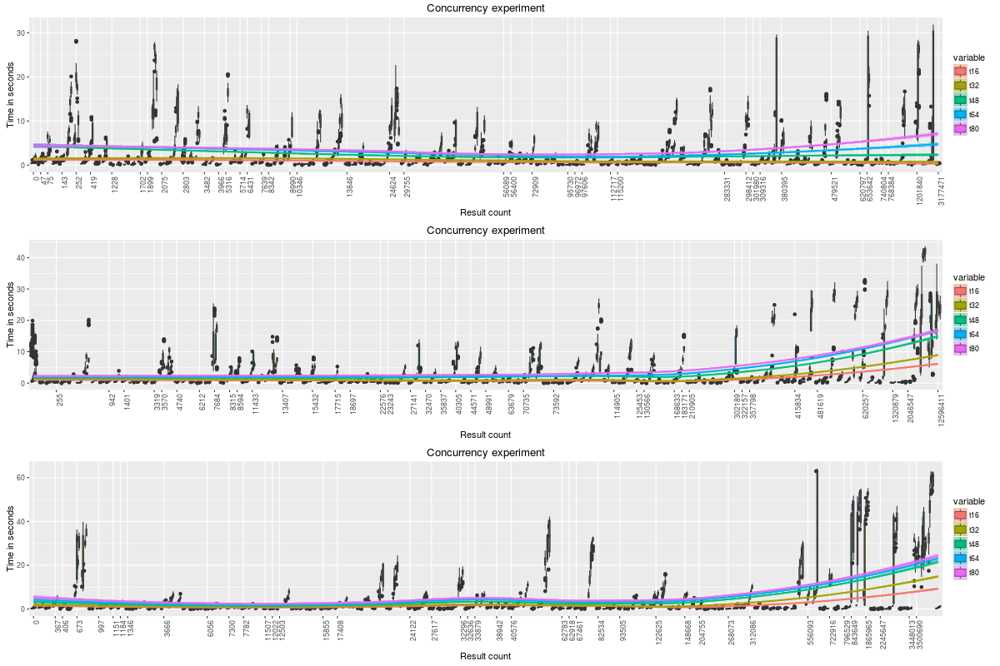
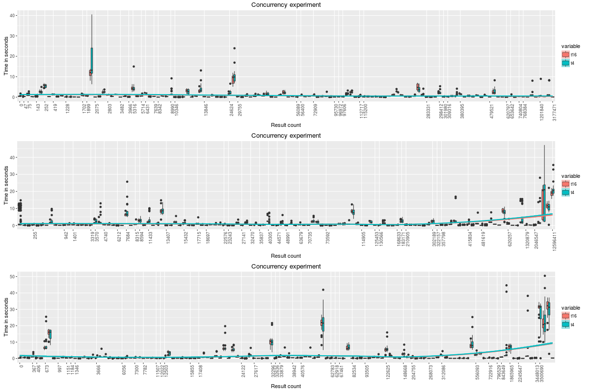
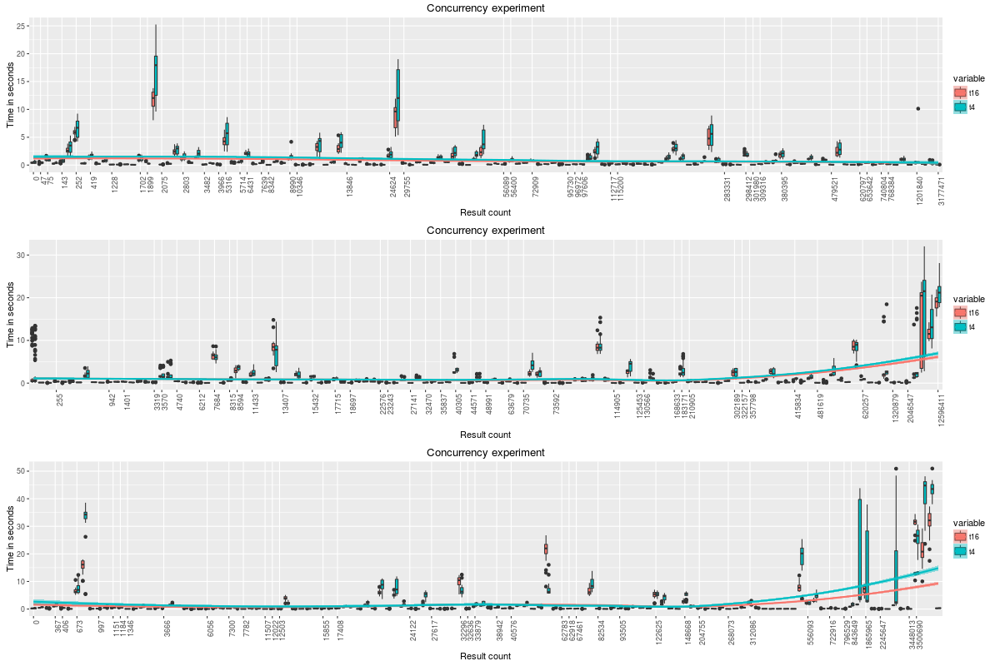

<h2>Table of Contents</h2>

<ul>
<li><a href="#sec-1">1. Setup</a>
<ul>
<li><a href="#sec-1-1">1.1. Imports</a></li>
<li><a href="#sec-1-2">1.2. Functions to load result</a></li>
</ul>
</li>
<li><a href="#sec-2">2. Description</a>
<ul>
<li><a href="#sec-2-1">2.1. Hardware</a></li>
<li><a href="#sec-2-2">2.2. Data</a></li>
<li><a href="#sec-2-3">2.3. Queries</a></li>
</ul>
</li>
<li><a href="#sec-3">3. Analysis</a>
<ul>
<li><a href="#sec-3-1">3.1. (1) All concurrency levels</a></li>
<li><a href="#sec-3-2">3.2. 3x20 client JVMS and 1x4 client JVM</a></li>
<li><a href="#sec-3-3">3.3. Minimizing the scan ranges</a></li>
</ul>
</li>
</ul>

# Setup

## Imports

    library(ggplot2)
    library(reshape2)

## Functions to load result

    load.results <- function(f) {
        data <- read.csv(f,sep=",",
                         header=F,
                         colClasses=c("character", "numeric", "numeric"),
                         stringsAsFactors = F)
        colnames(data) <- c("id", "elapsed", "count")
        data$id <- as.character(data$id)
        data
    }

    multiplot <- function(..., plotlist=NULL, file, cols=1, layout=NULL, title="") {
      library(grid)

      # Make a list from the ... arguments and plotlist
      plots <- c(list(...), plotlist)

      numPlots = length(plots)

      # If layout is NULL, then use 'cols' to determine layout
      if (is.null(layout)) {
        # Make the panel
        # ncol: Number of columns of plots
        # nrow: Number of rows needed, calculated from # of cols
        layout <- matrix(seq(1, cols * ceiling(numPlots/cols)),
                        ncol = cols, nrow = ceiling(numPlots/cols))
      }

      if (numPlots==1) {
        print(plots[[1]])

      } else {
        # Set up the page
        grid.newpage()
        pushViewport(viewport(layout = grid.layout(nrow(layout), ncol(layout))))

        # Make each plot, in the correct location
        for (i in 1:numPlots) {
          # Get the i,j matrix positions of the regions that contain this subplot
          matchidx <- as.data.frame(which(layout == i, arr.ind = TRUE))

          print(plots[[i]], vp = viewport(layout.pos.row = matchidx$row,
                                          layout.pos.col = matchidx$col))
        }
      }
    }

    analyzerun <- function(seed, t, basedir = "~/results/sunday/") {
        v <- paste('t', t, sep='')
        f <- paste(basedir, t, "/", seed, '.log.all.tsv', sep="")
        d <- load.results(f)
        dcall <- data.frame(id=d$id, t=d$elapsed, count=d$count)
        colnames(dcall) <- c("id", v, "count")
        dcallsorted <- dcall[order(dcall$count),]
        dcallsorted$id <- factor(d$count, levels = unique(dcallsorted$count))

        melt(dcallsorted, id.vars=c("id"), measure.vars=c(v))
    }

    plotrun <- function(dcmelt1) {
        labels = unique(dcmelt1$id)
        breaks = labels[seq(1, length(labels), by = 3)]

        ggplot(dcmelt1, aes(factor(id),value,fill=variable)) +
            geom_boxplot() +
            theme(axis.text.x = element_text(angle = 90, hjust = 1)) +
            scale_x_discrete(breaks = breaks) +
            geom_smooth(aes(x = as.integer(id), y=value,color=variable),method=loess) +
            labs(title = "Concurrency experiment", x = "Result count", y = "Time in seconds")

    }

# Description

I analyzed concurrent queries using a GeoMesa Accumulo instance with
the following characteristics.

## Hardware

1.  Tablet servers
    -   10 r3.xlarge
    -   JVM heap 20GB
    -   Accumulo data cache 14GB
2.  Client machines
    -   4 m4.16xlarge
    -   JVM Heap 48GB

## Data

Data consisted of 7 months of simulated ADS-B data.
-   4.67B points
-   460 total tables in z3
-   46 tablets per tserver

## Queries

1.  The query drivers were run concurrently on the client machines.
    Drivers were initialized with a seed and number of queries to run
    concurrently.  They then generated 128 random spatio-temporal
    queries of varying spatial size and temporal duration and executed
    all queries.  All experiments were repeated ten times.  Concurrency
    levels tested include 16 (4 per JVM), 32 (8 per JVM), 48 (12 per
    JVM), 64 (16 per JVM), and 80 (20 per JVM).

2.  A test was run with 3 JVMs executing 20 concurrent queries while 1
    JVM was executing 4 concurrent queries.  The intent is to see if
    there was any impact from client side thread contention.

3.  A test was run with geomesa.scan.ranges.target set to 10 (from a
    default of 2000) to evaluate the impact of number of ranges.

# Analysis

## (1) All concurrency levels

Each plot below shows all the time in seconds for all concurrency
levels for a given seed sorted by number of results.

## 3x20 client JVMS and 1x4 client JVM

The next plot shows the results from running just one JVM with 4
concurrent queries and 3 JVMs with 20 concurrent queries.  The plots
are against the results for 4 client JVMs with 4 concurrent queries
each.  The point of this plot is to reduce the impact of client side
thread contention.  As can be seen, the 4-concurrent client with 64
total concurrent queries performed the same as a 4-concurrent client
with 16 total concurrent queries.

## Minimizing the scan ranges

This experiment involved setting geomesa.scan.ranges.target=10 which
effectively limits the total number of scan ranges at the cost of more
false positives to prune client side.  It is compared to default scan
ranges of 2000.

